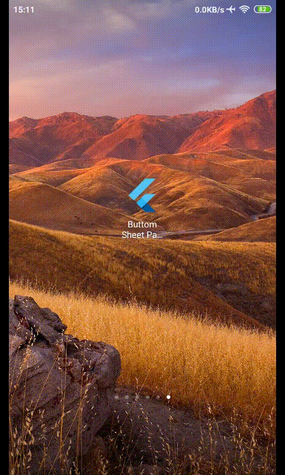

# Bottom Sheet Padding

## Overview

This project is a good starting point for developers who need to interact 
with Bottom Sheet in **Flutter**.

## Features

Features that are available in this app : 
- user can open bottom sheet
- bottom sheet is wrap therefore it will not take unnecessary space
- bottom sheet components are not hidden behind keyboard

## Demo

